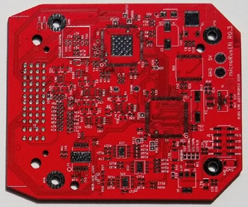
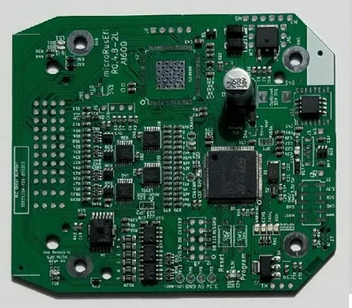
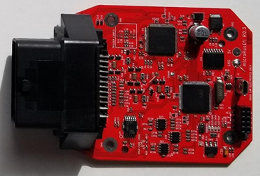
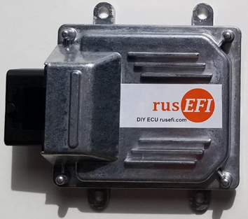

# RusEFI (RE) PCB Configurations

1. **Bare PCB**: No components soldered. For the end user, soldering would be required for **ALL** components. 

2. **Partially Pupulabed Board**: More than a half of components soldered to it. This board would require the end user to do some SMT and/or through-hole soldering to get a functional board.  

1. **Fully Populated Board**: No soldering is required by the end user to have a fully functional board but case is not included.  

1. **Fully Assembled**: All SMT and through hole devices are populated and the board is in a case. The end user does not need to open the case or ever look at the PCB. As far as the end user is concerned the product just needs to be wired in.  

## Options:
1.	**PnP (plug & play)**: If the board is designed to be plug and play, plugged into the OEM harness and operate properly. 
2.	**Add Connector**: If the board is sold with the harness side connectors required. 
3.	**Add Pigtail**: If the board is sold with the harness side connectors required and there are wires in the harness side connectors. 
4.	**Add Harness**: If the board is sold with a vehicle specific harness so that the ECU needs to be connected to the vehicle with the harness and the engine will start.
