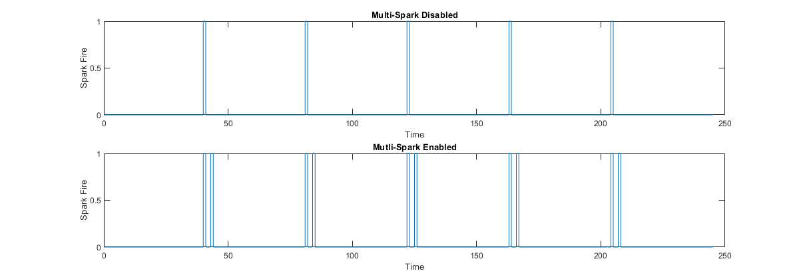

# Multi-spark  
Mutli-spark is a feature that will fire the ignition coil for a single cylinder multiple times in a single stroke. This is useful for cold start conditions where complete fuel burn may not occur from a single spark. During multi-spark the first ignition will be a partial burn and stir up the remaining fuel in the cylinder allowing subsequent burns to create a more complete fuel burn. 

## Working Theory
During low speed operation if there is enough time for the dwell period of an ignition coil in a single power stroke the ECU can fire the ignition coil multiple times. The result of this will be a more complete fuel burn giving more power, better fuel economy, and lower emissions. The downside is that due to the ignition coil firing multiple times per power stroke the ignition coil will operate *hotter* possibly leading to overheating and lower ignition coil life spans. 

## Disclaimer
Currently the mutli-spark in RusEFI is completely experimental and should only be used as such. The owner and user can use at their own risk to catostrophic damage to their ECU, engine, and vehicle. 

## How-to Enable
Currently you need to push some buttons, agree to some stuff, and change some settings. TODO: Learn how to enable this feature. 